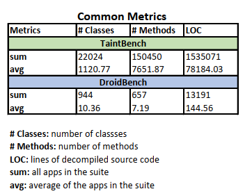

**Notice**: Please cite the following paper if you are using TaintBench: 

@article{TaintBench2021,  
author = {Linghui Luo and Felix Pauck and Goran Piskachev and Manuel Benz and Ivan Pashchenko and Martin Mory and Eric Bodden and Ben Hermann and Fabio Massacci}, 
title = {TaintBench: Automatic Real-World Malware Benchmarking of Android Taint Analyses},  
year = {2021},  
journal = {Empirical Software Engineering},  
note = {to appear}  
}

# How does TaintBench compare to DroidBench?
## List of Evaluated Benchmark Suites
- [DroidBench (3.0)](https://github.com/secure-software-engineering/DroidBench/tree/develop) 
- [TaintBench](https://taintbench.github.io/taintbenchSuite/)

## Usage of Sources and Sinks
- **Lists of potential sources and sinks**:
    - [List of Sources](https://github.com/TaintBench/TaintBench/blob/master/merged_sources.txt) 
    - [List of Sinks](https://github.com/TaintBench/TaintBench/blob/master/merged_sinks.txt)
- **Results**: 

## Call-Graph Complexity
- **Results**: 

## Code Complexity
- **Results**: 

# How effective are taint analysis tools on TaintBench compared to DroidBench?

## List of Evaluated Tools

| Tool          | Version           | Source  |
| ------------- |-------------|-----|
| Amandroid	 | November 2017 (3.1.2) 	| [Link](https://bintray.com/arguslab/maven/argus-saf/3.1.2)|         
| Amandroid* | December 2018 (3.2.0) 	| [Link](https://bintray.com/arguslab/maven/argus-saf/3.2.0)|          
| FlowDroid	 | April 2017 (Nightly)  	| [Link](https://github.com/secure-software-engineering/soot-infoflow-android/wiki)| 
| FlowDroid* | January 2019 (2.7.1)  	| [Link](https://github.com/secure-software-engineering/FlowDroid/releases/tag/v2.7.1)| 

[Download All Tools](https://github.com/TaintBench/TaintBench/releases/tag/TaintAnalysisTools)

## Experiment 1 (Default)
**Configuration**: 
All tools are executed in their default configuration. Sources and sinks configured for the tools can be found below:
- [Amandroid & Amandroid*](https://github.com/TaintBench/TaintBench/blob/master/AD_SourcesAndSinks.txt)
- [FlowDroid & FlowDroid*](https://github.com/TaintBench/TaintBench/blob/master/FD_SourcesAndSinks.txt)

## Experiment 2 (Suite-level)
**Configuration**: 
All tools are configured with sources and sinks defined in benchmark suite. Sources and sinks of the benchmark suites configured for the tools can be found below:
- [DroidBench](https://github.com/TaintBench/TaintBench/blob/master/DB_SourcesAndSinks.txt)
- [TaintBench](https://github.com/TaintBench/TaintBench/blob/master/TB_SourcesAndSinks.txt)  

## Experiment 3 (App-level)
**Configuration**: 
For each benchmark app, a list of sources and sinks defined in this app is used to configure all tools. Each tool analyzes each benchmark app with the associated list of sources and sinks. 

## Experiment 4 (Case-level)
**Configuration**: 
For each benchmark case (taint flow), only the source and sink defined in this case is used to configure all tools. 

Assume a benchmark app contains `N` benchmark cases, each tool analyzes the benchmark app `N` times. Each time the tools are configured with the associated source and sink for the respective benchmark case. 

## Experiment 5 (Minified App)
For each positive benchmark case, a minified Apk is generated by the MinApkGenerator. 

## Experiment 6 (Delta App)
For each positive benchmark case, a delta Apk is generated by the DeltaApkGenerator. 
