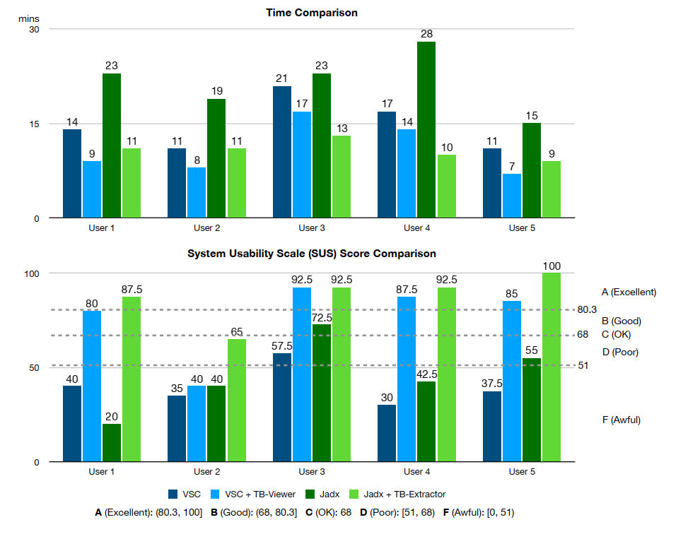

# User Study Design
We conducted a user study with five users (experts in taint analysis) to evaluate the effectiveness of TB-Extractor and TB-Viewer.

| Task                | Description                                                                  |
|---------------------|------------------------------------------------------------------------------|
| VSC                 | Inspection task with VSC ([Download](img/data/Session1.pdf))                     |
| VSC + TB-Viewer     | Inspection task with VSC and TB-Viewer ([Download](img/data/Session2.pdf))       |
| Jadx                | Documentation task with Jadx ([Download](img/data/Session3.pdf))                 |
| Jadx + TB-Extractor | Documentation task with Jadx and TB-Extractor ([Download](img/data/Session4.pdf))|

You can download a sample package containing all materials designed for a single user from [here](https://github.com/TaintBench/TaintBench/releases/download/UserStudy/UserStudy.zip).

# Evaluation Results

# User comments

## After solving the task **Jadx + TB-Extractor**

"Very self explanatory system."

"Easy to use! However, the description of the taint flow is in a seperate window. But the window is well designed."

"It is very easy to solve this task with this system since the lines only need to be selected with the shortcut and the data is automatically filled into the file. This goes pretty fast."

"System allows to work very efficiently, but at one point it seemed to warn me about an error that was not there..."

"Fairly easy to use. Having to check two different systems is still not ideal, but it's much easier than before and when one has them side by side, the documentation process is comparatively straightforward."

## After solving the task **VSC + TB-Viewer**

"Felt well supported by the tool"

"Finding the sources and sinks is much easier than without the system. Still it is not always easy to find the path between source and sink. Overall, the task is much easier to solve than without the system and gives higher confidence in giving the correct evaluation."

"Not having to switch back and forth constantly between VS Code and the xml file took away a lot of possible problem vectors. Like scrolling too far, misreading a line, misunderstanding what a particular line in the xml means. Even though the tool didn't provide a lot more functionality (the 'jump to' feature is much appreciated) than the xml-based solution, I still felt more secure with my results in the end."

"The tool is easy to use. Supporting many language features and highlighting (jumping to the declaration would be nice) helps understanding the source code and using the tool.
Information regarding the taint flows is integrated which is nice (A marker at the code line of a source/sink would be nice)."

"without path/trace, it feels cumbersome"